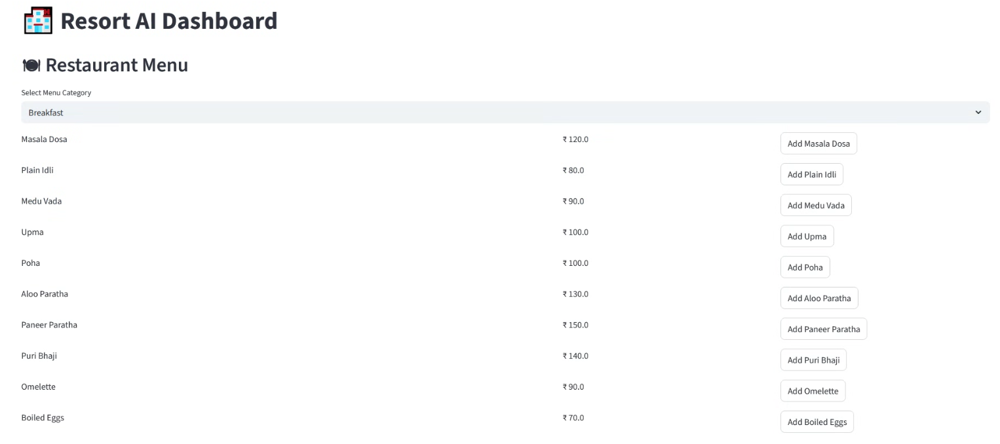
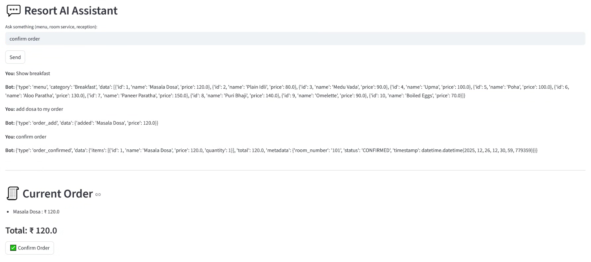

🔷 Agentic Resort AI Assistant

###**Overview**

This project implements an Agentic AI-based Resort Assistant that handles guest interactions across multiple departments using LLM-powered agents, rule-based fallbacks, and a shared backend.
The system supports restaurant ordering, room service requests, and reception queries, along with an optional operations dashboard.

The design follows a modular multi-agent architecture with clear separation of responsibilities.

**System Architecture**
###🔷 High-Level Flow
User Input
   ↓
Router Agent (Intent Classification)
   ↓
┌─────────────┬────────────────┬─────────────────┐
│ Reception   │ Restaurant     │ Room Service    │
│ Agent       │ Agent          │ Agent           │
└─────────────┴────────────────┴─────────────────┘
        ↓              ↓               ↓
   Static / DB     Menu + Orders     Service Requests

###🔷 Core Components
1️⃣ Router Agent

**Purpose**:
Routes each user message to the appropriate department agent.

How it works:

Uses an LLM (ChatOpenAI) for intent classification

Supported intents:

-   RECEPTION

-   RESTAURANT

-   ROOM_SERVICE

Includes keyword-based fallback for reliability

Why:
Prevents overloading a single agent and ensures clean responsibility separation.

2️⃣ Receptionist Agent

Handles general resort enquiries.

Capabilities:

-   Check-in time

-   Check-out time

-   Facility information (gym, spa, pool, Wi-Fi)

-   Room availability (mocked)

Implementation:

Static responses stored in config / code

Mock room availability logic (acceptable per assignment)

3️⃣ Restaurant Agent (LLM-Driven)

Handles the complete food ordering workflow.

Capabilities:

-   Show menu by category

-   Search food items

-   Get item prices

-   Add items to order

-   View current order

-   Confirm order & calculate bill

Key Design Choices:

  Hybrid Intent Handling

  -   LLM for flexible natural language understanding

  -   Deterministic rule guards for critical flows (e.g., “show breakfast”)

Uses SQLAlchemy to fetch menu data

Uses in-memory order store (can be replaced by DB/Redis later)

Order Data Structure Includes:

-   Ordered items

-   Item prices

-   Total amount

-   Timestamp

-   Order status

4️⃣ Order Memory & Tools

Purpose:
Maintain state across conversation turns.

Current Implementation:

In-memory Python store

Functions:

  -  add_item

  -  view_order

  -  calculate_total

  -  confirm_order

Note:
Designed for easy migration to persistent storage.

5️⃣ Room Service Agent

Handles service requests from guests.

Capabilities:

-   Room cleaning

-   Laundry

-   Extra amenities (towels, pillows, blankets, toiletries)

Request Data Includes:

-   Room number (mocked)

-   Request type

-   Timestamp

-   Status (Pending / In Progress / Completed)

6️⃣ Resort Operations Dashboard (Optional)

Built using Streamlit.

Displays:

-   Restaurant orders

-   Order totals

-   Room service requests

-   Request statuses

Purpose:
Provides a simple operational view for staff.

###🛠️ Tech Stack

-   Python 3

-   LangChain + OpenAI (ChatOpenAI)

-   SQLAlchemy

-   SQLite

-   Streamlit (Dashboard)

  Pandas (Excel data ingestion)
  
▶️ How to Run
1️⃣ Install dependencies
pip install -r requirements.txt

2️⃣ Set OpenAI API Key
Create a .env file:
OPENAI_API_KEY=your_api_key_here

3️⃣ Run the Chat Assistant
python -m backend.main

4️⃣ Run the Dashboard (Optional)
streamlit run dashboard/app.py

## 📊 Dashboard Screenshots

### Resort Operations Dashboard

### Restaurant Order Workflow
